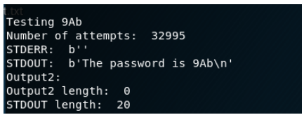
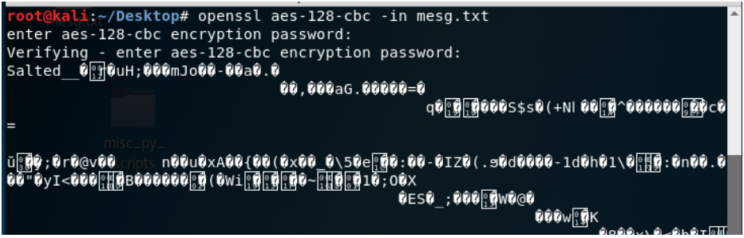
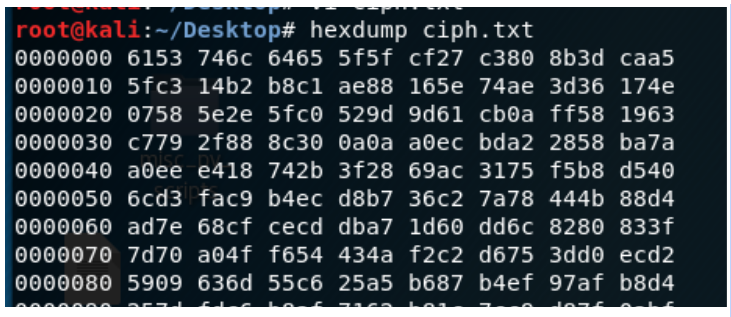
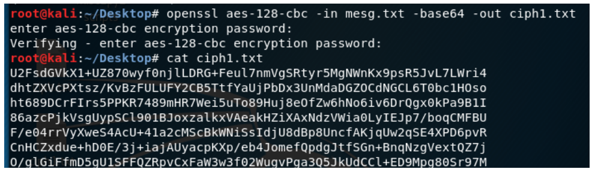
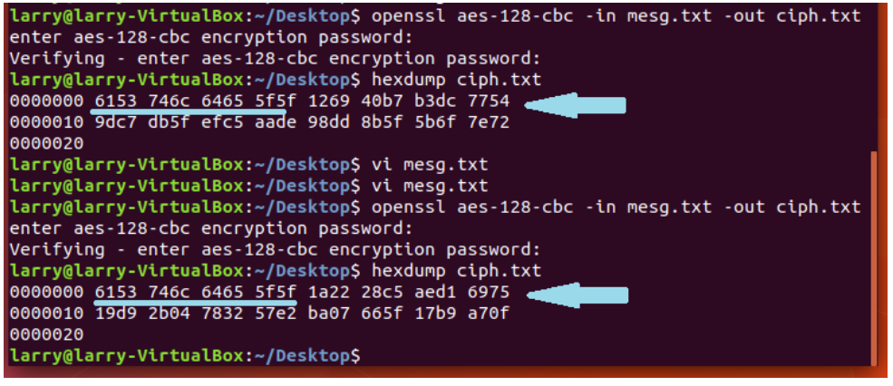
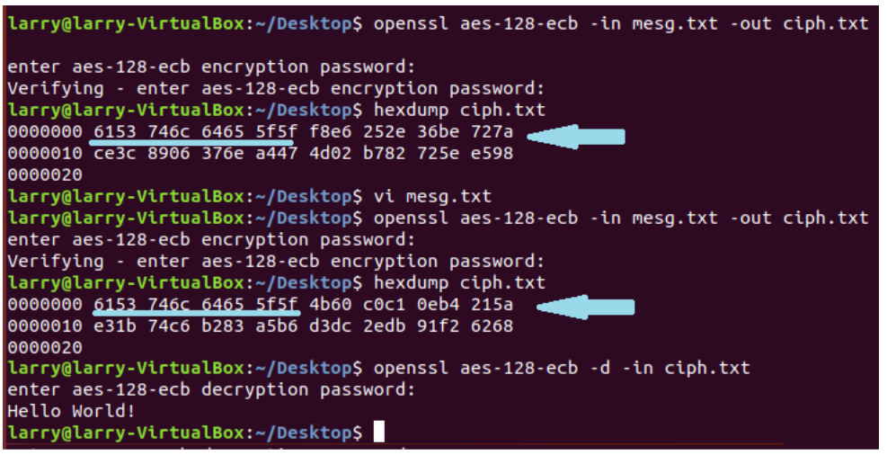
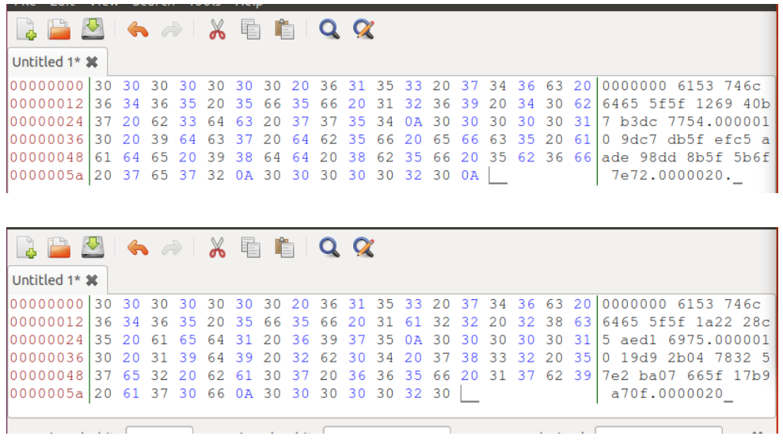

This Readme is Proof of Concept for the OpenSSL password cracker and also discusses some OpenSSL basics. 

# BRUTE-FORCE PASSWORD-CRACKING PROOF OF CONCEPT

**Problem:** A file was encrypted with `openssl aes-256-cbc -a` and the output was: 

  `U2FsdGVkX1/1d2B8DjES8wOr5cSS8O3zxEekgPfvHXAcHoqcJS9bxDr70+nfgyNT`

The password is a three-character password selected from lowercase letters, uppercase letters and digits.

**Solution**

`openssl_bruter.py` reads a file containing all possible passwords, and uses a “for” loop to iterate & inject the possible passwords into an openssl-decrypt-command.  For each decrypt attempt, the script prints the character combination being inserted into the decrypt command, the attempt number, the outputs for STDERR and STDOUT, an "Output2" variable which is STDERR cleaned up, the length of Output2 and the length of STDOUT. Since the encryption message length was short, I could measure the length of the STDOUT to determine when the message was decrypted. There was a lot of trial-and-error in determining the threshold length for the decrypted language, so there I would like to create a better “win condition”, which is difficult when working with “byte-object” outputs.

Here is the output for the decrypted message. STDERR length is 0 because there was no error decrypting the message with the tested character combination, seen in "Testing":

# USING OPENSSL TO ENCRYPT WITH CBC & ECB

## OpenSSL Basic Syntax

**CBC (cipher block chaining):** 

The syntax to encrypts a message into pseudo-random binary data and print the output to terminal is:`openssl  <cipher> -in <input-file>`

&lt;cipher> is called the “key length” and this is where you would insert for example: `aes-128-cbc`. Other key lengths are: `aes-192-cbc` & `aes-256-cbc`. The bigger the key length, the harder the encrypted message is to brute force.

Use the `-out` command to redirect the output to a text file, for example: `openssl aes-128-cbc -in mesg.txt -out ciph.txt`

You can convert the binary file into "hex" with the hexdump command, for example: `hexdump ciph.txt`

Now decrypt the file using the same key length: `openssl aes-128-cbc -d -in ciph.txt`

**ECB (Electronics Code Book):**

Instead of using `cbc` in your commands for Ciper Block Chain encryption, you can use `ecb` for Electronics Code Book encryption: `openssl aes-128-ecb -in mesg.txt -out ciph.txt`

## Commands output

The images below contain outputs of the basic commands.  The original message was a poem.

This is a partial image of a CBC encryption output to terminal:

This is a partial image of the same encrypted message, but viewed in **VI**:

This is a partial image of the same encrypted message, after a hexdump command:

This is a partial image of the same message, but encrypted with -base64 command:

## Hexadecimal Comparisons of CBC vs. ECB encryption output

The images below compare the hexadecimal outputs of a CBC and ECB encryptions when a slight change is made to the message. This can show how easy it can be to change the hash signature of a file just by changing one letter.

1st message is **Hello World!** and 2nd message is **Yello World!**  The hexdumps are 256 bits long.  Only the first 64 bits of each hexdump match.  

Comparison of ECB encrypted messages: 1st message is **Yello World!** and 2nd message is **Hello World!**  Same as above, only the first 64 bits of each hexdump match. 

Same comparison as above, but viewed in **bless hex editor**.

#### References

Sisso. (2012, Aug. 22). Stack Overflow. Convert bytes to a string? Retrieved from: https://stackoverflow.com/questions/606191/convert-bytes-to-a-string

Canary, H. (2013, Apr. 3) Stack Overflow. Python Popen sending to process on stdin, receiving on stdout. Retrieved from: https://stackoverflow.com/questions/15785148/python-popen-sending-to-process-on-stdin-receiving-on-stdout

Julien, C. (2011, Nov. 25). Stack Overflow. Python remove all whitespace in a string. Retieved from: https://stackoverflow.com/questions/8270092/python-remove-all-whitespace-in-a-string

Hunner, Trey. (2016, Apr. 25). How to Loop With Indexes in Python.  Retrieved from: http://treyhunner.com/2016/04/how-to-loop-with-indexes-in-python/

Goldberg, C. (2013, Oct. 10). Stack Overflow. How do you read a file into a list in Python? [duplicate]. Retrieved from: https://stackoverflow.com/questions/3925614/how-do-you-read-a-file-into-a-list-in-python

Brosta (Oct. 4, 2017). Stack Overflow. Python: Using openssl via subprocess to decrypt with a variable password. Retrieved from: https://stackoverflow.com/questions/46568595/python-using-openssl-via-subprocess-to-decrypt-with-a-variable-password
  
Petri, H. & Gutmann, H. (n.d.). PyFormat Using % and .format() for great good! Retrieved from: https://pyformat.info/

