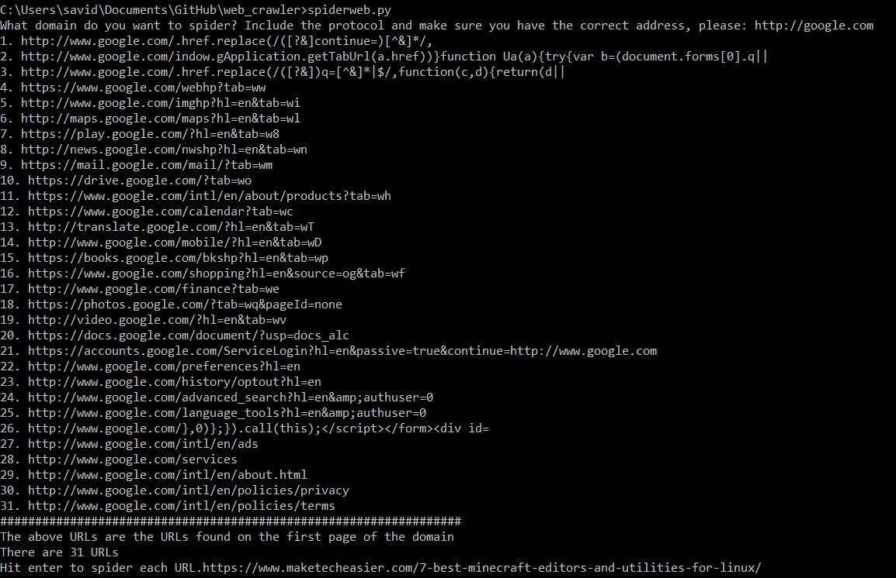

# web_crawler

web_crawler prints `What domain do you want to spider? Include the protocol and make sure you have the correct address, please:` User enters, for example: `https:\\www.google.com `. Output:

